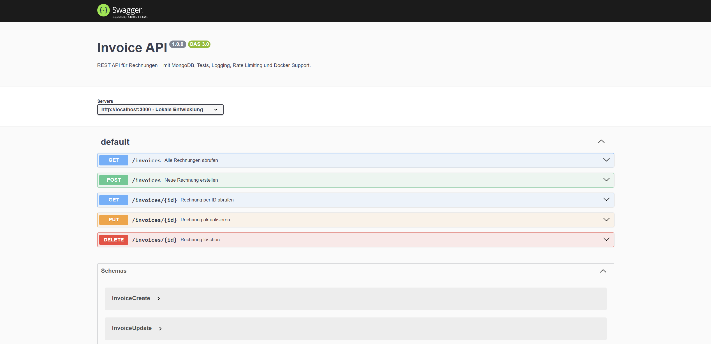

# Invoice API


A production-oriented REST API for invoice management built with Node.js, Express, MongoDB, Docker and Swagger.

---

## About the Project

Invoice API is a backend service that demonstrates modern REST API development practices.

The application provides full CRUD functionality for invoice management and includes features commonly used in real-world backend systems such as:

- REST API architecture
- MongoDB & Mongoose integration
- Swagger / OpenAPI documentation
- Automated testing with Jest & Supertest
- Docker containerization
- Request logging
- Rate limiting
- Monitoring endpoints
- Centralized error handling
- MVC architecture

The project was built as a portfolio project to showcase backend engineering skills and production-ready API design.

---

## Swagger Documentation

Swagger UI is available after starting the application:

```bash
http://localhost:3000/docs
```

### Swagger Preview



---

## Features

| Feature | Description |
|----------|-------------|
| CRUD API | Create, Read, Update and Delete invoices |
| MongoDB | Persistent invoice storage |
| Swagger | Interactive API documentation |
| Docker | Containerized deployment |
| Logging | Centralized request logging |
| Rate Limiting | Basic API protection |
| Monitoring | Health and metrics endpoints |
| Validation | Request validation support |
| Automated Tests | Jest & Supertest integration |

---

## Tech Stack

- Node.js
- Express.js
- MongoDB
- Mongoose
- Docker
- Jest
- Supertest
- Swagger / OpenAPI

---

## API Endpoints

| Method | Endpoint | Description |
|---------|----------|-------------|
| GET | /invoices | Get all invoices |
| GET | /invoices/:id | Get invoice by ID |
| POST | /invoices | Create invoice |
| PUT | /invoices/:id | Update invoice |
| DELETE | /invoices/:id | Delete invoice |

---

## Project Structure

```text
invoice-api/
│
├── controllers/
├── docs/
├── middleware/
├── models/
├── routes/
├── services/
├── swagger/
├── tests/
├── utils/
│
├── Dockerfile
├── package.json
├── index.js
└── README.md
```

---

## Environment Variables

Create a `.env` file:

```env
PORT=3000
MONGODB_URI=mongodb://127.0.0.1:27017/invoice-api
API_KEY=your_api_key_here
```

### Test Environment

The repository contains a dedicated `.env.test` configuration that uses local test values only:

```env
MONGODB_URI=mongodb://localhost:27017/invoice-api-test
PORT=3001
API_KEY=test-api-key
```

No production credentials are stored in the repository.

---

## Installation

Clone the repository:

```bash
git clone https://github.com/tabari86/invoice-api.git
cd invoice-api
```

Install dependencies:

```bash
npm install
```

---

## Start Application

Development mode:

```bash
npm start
```

Application runs on:

```bash
http://localhost:3000
```

---

## Run Tests

```bash
npm test
```

All API tests are executed using Jest and Supertest.

---

## Docker

Build image:

```bash
docker build -t invoice-api .
```

Run container:

```bash
docker run -p 3000:3000 invoice-api
```

---

## Monitoring

Health endpoint:

```bash
GET /monitor/health
```

Metrics endpoint:

```bash
GET /monitor/metrics
```

---

## Security Features

- Rate Limiting
- Centralized Error Handling
- Input Validation
- Request Logging
- API Monitoring

---

## Author

**Mojtaba Tabari**

Website : 
https://mtintelligence.ai

LinkedIn : 
https://www.linkedin.com/in/moj-tabari-04a400227/
